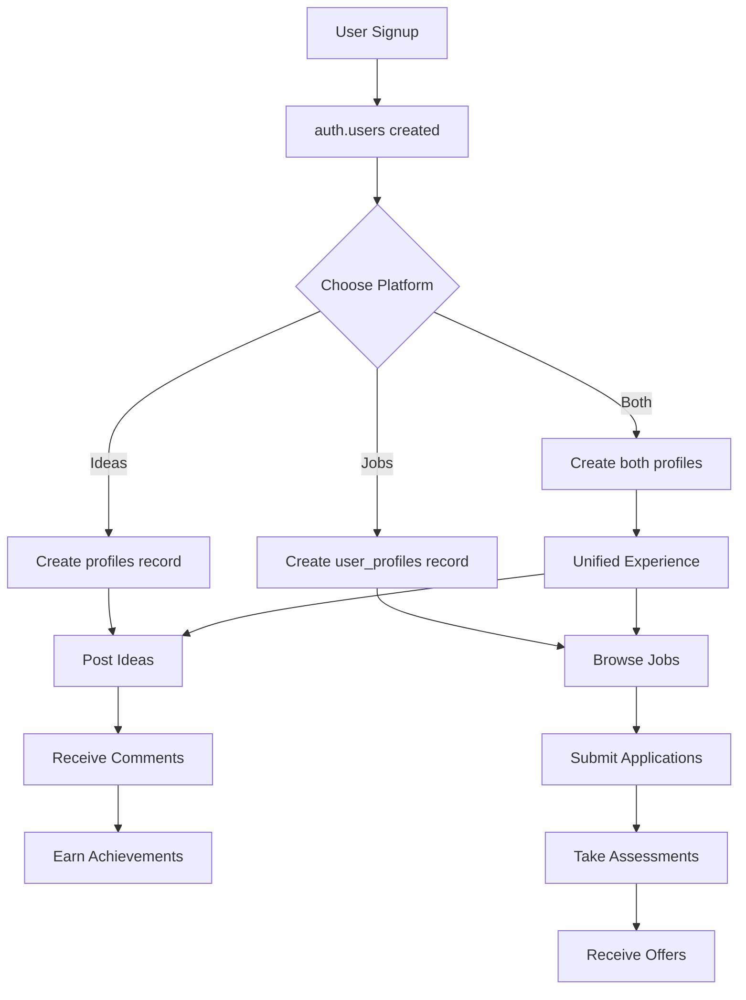

# NeuraCore Database Dependencies & RLS Analysis Report
**Generated:** November 3, 2025  
**Project:** NeuraCore - Ideas Platform & Job Marketplace  
**Database:** Supabase PostgreSQL (Project: tzmrxlqenfiqabjrbpvg)  
**Analysis Method:** MCP Server Live Database Query

---

## Executive Summary

### Database Architecture
- **Total Tables:** 21 (public schema)
- **Two Platforms:** Ideas Platform (9 tables) + Job Marketplace (12 tables)
- **RLS Protection:** 9/21 tables (43%)
- **Foreign Key Relationships:** 45 constraints
- **RLS Policies:** 36 policies across protected tables

### Critical Security Status
| Status | Count | Percentage | Impact |
|--------|-------|------------|--------|
| ✅ **RLS Enabled** | 9 tables | 43% | Ideas platform protected |
| ❌ **RLS Disabled** | 12 tables | 57% | Job marketplace exposed |
| ⚠️ **Partial Policies** | 3 tables | 14% | Assessment, company, job data |

---

## Table of Contents
1. [Table Dependency Graph](#1-table-dependency-graph)
2. [Ideas Platform Dependencies](#2-ideas-platform-dependencies)
3. [Job Marketplace Dependencies](#3-job-marketplace-dependencies)
4. [RLS Policy Analysis](#4-rls-policy-analysis)
5. [Cross-Platform Dependencies](#5-cross-platform-dependencies)
6. [Security Recommendations](#6-security-recommendations)

---

## 1. Table Dependency Graph

### Complete Dependency Tree

```
auth.users (Supabase Auth - Root Table)
├── profiles (Ideas Platform)
│   └── [No dependencies, leaf table]
│
├── user_profiles (Dual Platform)
│   └── [No dependencies, leaf table]
│
├── user_profiles_enhanced (Job Marketplace)
│   └── [No dependencies, leaf table]
│
├── ideas (Ideas Platform)
│   ├── comments
│   │   ├── likes (comment likes)
│   │   └── comments (self-referential: parent_id → comments.id)
│   └── likes (idea likes)
│
├── follows (Ideas Platform)
│   └── [Self-referential: follower_id & following_id → auth.users.id]
│
├── user_achievements (Ideas Platform)
│   └── achievements
│       └── [No dependencies, leaf table]
│
├── notifications (Ideas Platform)
│   └── [No dependencies, leaf table]
│
├── companies (Job Marketplace - Root for company hierarchy)
│   ├── company_members
│   │   └── [Circular: invited_by → auth.users.id]
│   ├── job_openings
│   │   └── job_applications
│   │       ├── assessment_attempts
│   │       │   └── skill_assessments
│   │       │       └── [Circular: company_id → companies.id]
│   │       ├── contracts
│   │       │   └── [Circular: signed_by → auth.users.id]
│   │       └── offers
│   │           └── [No dependencies, leaf table]
│   ├── job_openings_enhanced
│   │   └── job_applications_enhanced
│   │       └── [No dependencies, leaf table]
│   ├── proposals
│   │   └── [client_id → auth.users.id]
│   ├── skill_assessments
│   │   └── assessment_attempts
│   │       └── [user_id → auth.users.id]
│   └── contracts
│       └── [contractor_id → auth.users.id]
```

### Dependency Summary Table

| Table | Depends On | Referenced By | Depth | Platform |
|-------|------------|---------------|-------|----------|
| **auth.users** | - | 16 tables | 0 (root) | Auth |
| **profiles** | auth.users | - | 1 | Ideas |
| **ideas** | auth.users | comments, likes | 1 | Ideas |
| **comments** | ideas, auth.users, comments | likes, comments | 2 | Ideas |
| **likes** | ideas, comments, auth.users | - | 3 | Ideas |
| **follows** | auth.users (2x) | - | 1 | Ideas |
| **achievements** | - | user_achievements | 0 | Ideas |
| **user_achievements** | achievements, auth.users | - | 1 | Ideas |
| **notifications** | auth.users | - | 1 | Ideas |
| **user_profiles** | auth.users | - | 1 | Dual |
| **companies** | auth.users | 7 tables | 1 | Job |
| **company_members** | companies, auth.users (2x) | - | 2 | Job |
| **job_openings** | companies, auth.users (2x) | job_applications | 2 | Job |
| **job_applications** | job_openings, auth.users (2x) | 3 tables | 3 | Job |
| **skill_assessments** | companies, auth.users | assessment_attempts | 2 | Job |
| **assessment_attempts** | skill_assessments, job_applications, auth.users | - | 4 | Job |
| **contracts** | companies, job_applications, auth.users (2x) | - | 4 | Job |
| **offers** | job_applications | - | 4 | Job |
| **proposals** | companies, auth.users | - | 2 | Job |
| **user_profiles_enhanced** | auth.users | - | 1 | Job |
| **job_openings_enhanced** | companies, auth.users | job_applications_enhanced | 2 | Job |
| **job_applications_enhanced** | job_openings_enhanced, auth.users | - | 3 | Job |

---

## 2. Ideas Platform Dependencies

### Platform Overview
- **Tables:** 9
- **RLS Coverage:** 100% (all 9 tables protected)
- **Max Depth:** 3 levels (auth.users → ideas → comments → likes)

### Dependency Details

#### **Level 1: User Identity**
```sql
auth.users (Root)
├── profiles
│   FK: profiles.id → auth.users.id (ON DELETE CASCADE)
│   Purpose: Extended user profile for ideas platform
│   RLS: ✅ Enabled (3 policies)
│
├── user_profiles
│   FK: user_profiles.user_id → auth.users.id (ON DELETE CASCADE)
│   Purpose: Comprehensive user data (dual platform)
│   RLS: ✅ Enabled (7 policies - most restrictive)
│
└── follows
    FK: follows.follower_id → auth.users.id
    FK: follows.following_id → auth.users.id
    Purpose: Social connections (self-referential)
    RLS: ✅ Enabled (2 policies)
```

#### **Level 2: Content Creation**
```sql
ideas (Content Root)
├── FK: ideas.author_id → auth.users.id
├── Purpose: User-generated idea content
├── RLS: ✅ Enabled (4 policies)
├── Relationships:
│   ├── comments.idea_id → ideas.id
│   └── likes.idea_id → ideas.id
│
└── Dependencies:
    • Must check author_id for ownership
    • Status field controls visibility ('draft'|'published'|'archived')
    • No cascade delete (orphaned comments possible)
```

#### **Level 3: Engagement**
```sql
comments (Threaded Discussions)
├── FK: comments.idea_id → ideas.id
├── FK: comments.author_id → auth.users.id
├── FK: comments.parent_id → comments.id (Self-referential for threading)
├── Purpose: Hierarchical comment system
├── RLS: ✅ Enabled (4 policies)
├── Referenced By:
│   └── likes.comment_id → comments.id
│
└── Cascade Logic:
    • If idea deleted → comments orphaned (no cascade)
    • If parent comment deleted → child comments orphaned
    • Requires manual cleanup or trigger
```

#### **Level 4: Social Signals**
```sql
likes (Engagement Tracking)
├── FK: likes.user_id → auth.users.id
├── FK: likes.idea_id → ideas.id (nullable)
├── FK: likes.comment_id → comments.id (nullable)
├── Purpose: Like/upvote system (either idea OR comment)
├── RLS: ✅ Enabled (2 policies)
├── Constraint: Must have idea_id OR comment_id (not both)
└── Check: idea_id IS NOT NULL OR comment_id IS NOT NULL
```

#### **Gamification System**
```sql
achievements (Badge Definitions)
├── No FK dependencies (standalone)
├── Purpose: Achievement/badge catalog
├── RLS: ✅ Enabled (1 policy - public read)
└── Referenced By:
    └── user_achievements.achievement_id → achievements.id

user_achievements (User Progress)
├── FK: user_achievements.user_id → auth.users.id
├── FK: user_achievements.achievement_id → achievements.id
├── Purpose: Track earned achievements per user
└── RLS: ✅ Enabled (2 policies)
```

#### **Communication**
```sql
notifications (Real-time Alerts)
├── FK: notifications.user_id → auth.users.id
├── Purpose: User notification queue
├── RLS: ✅ Enabled (1 policy - owner only)
└── Fields:
    • related_id (UUID): Links to ideas, comments, etc.
    • type: Categorizes notification
```

### Ideas Platform Dependency Rules

| Action | Cascade Behavior | Data Integrity |
|--------|------------------|----------------|
| **User Deletion** | profiles deleted (CASCADE) | ✅ Safe |
| **User Deletion** | ideas.author_id set null | ⚠️ Orphaned ideas |
| **Idea Deletion** | comments retained | ❌ Orphans |
| **Idea Deletion** | likes retained | ❌ Orphans |
| **Comment Deletion** | Child comments retained | ❌ Orphans |
| **Achievement Deletion** | user_achievements deleted | ✅ Safe (cascade) |

---

## 3. Job Marketplace Dependencies

### Platform Overview
- **Tables:** 12
- **RLS Coverage:** 25% (3/12 tables have partial policies)
- **Max Depth:** 4 levels (auth.users → companies → job_openings → job_applications → contracts)

### Critical Security Gap
⚠️ **57% of tables lack RLS protection**, exposing:
- Company profiles and members
- Job postings (except public view)
- Application data (except applicant view)
- Assessment results
- Contract details
- Offer information

### Dependency Details

#### **Level 1: Company Root**
```sql
companies (Company Profiles)
├── FK: companies.owner_id → auth.users.id
├── Purpose: Company/employer profiles
├── RLS: ❌ DISABLED (1 policy exists but RLS off)
├── Referenced By: 7 tables
│   ├── company_members
│   ├── job_openings
│   ├── job_openings_enhanced
│   ├── skill_assessments
│   ├── contracts
│   └── proposals
│
└── Data Exposure:
    • All company data publicly accessible
    • No ownership validation on updates
    • Tax ID, registration numbers exposed
```

#### **Level 2: Company Team**
```sql
company_members (Team Management)
├── FK: company_members.company_id → companies.id
├── FK: company_members.user_id → auth.users.id
├── FK: company_members.invited_by → auth.users.id
├── Purpose: Company team roster with roles
├── RLS: ❌ DISABLED (2 policies exist but RLS off)
├── Roles: owner, admin, hr_manager, recruiter, hiring_manager, member
│
└── Security Risk:
    • Anyone can see all company members
    • Permissions JSONB not enforced
    • Invitation system not protected
```

#### **Level 3: Job Postings**
```sql
job_openings (Detailed Job Posts)
├── FK: job_openings.company_id → companies.id
├── FK: job_openings.created_by → auth.users.id
├── FK: job_openings.hiring_manager_id → auth.users.id
├── Purpose: Full-featured job posting system
├── RLS: ❌ DISABLED (1 policy for public view only)
├── Referenced By:
│   └── job_applications.job_opening_id → job_openings.id
│
└── Fields at Risk:
    • Salary ranges (confidential during draft)
    • Screening questions (competitors can see)
    • Application statistics
    • Internal notes

job_openings_enhanced (Simplified Job Posts)
├── FK: job_openings_enhanced.company_id → companies.id
├── FK: job_openings_enhanced.created_by → auth.users.id
├── Purpose: Lightweight job posting alternative
├── RLS: ❌ DISABLED (no policies)
└── Relationship: Parallel to job_openings (not linked)
```

#### **Level 4: Applications**
```sql
job_applications (Full Application System)
├── FK: job_applications.job_opening_id → job_openings.id
├── FK: job_applications.applicant_id → auth.users.id
├── FK: job_applications.referrer_id → auth.users.id (nullable)
├── Purpose: Complete application lifecycle management
├── RLS: ❌ DISABLED (4 policies exist but RLS off)
├── Referenced By:
│   ├── assessment_attempts
│   ├── contracts
│   └── offers
│
└── Policies (Not Enforced):
    1. Applicants can insert own applications
    2. Applicants can view own applications
    3. Recruiters can view company applications
    4. Applicants can update own applications

job_applications_enhanced (Simplified Applications)
├── FK: job_applications_enhanced.job_opening_id → job_openings_enhanced.id
├── FK: job_applications_enhanced.applicant_id → auth.users.id
├── Purpose: Lightweight application alternative
├── RLS: ❌ DISABLED (no policies)
└── Relationship: Parallel to job_applications (not linked)
```

#### **Assessment System**
```sql
skill_assessments (Assessment Definitions)
├── FK: skill_assessments.created_by → auth.users.id
├── FK: skill_assessments.company_id → companies.id (nullable)
├── Purpose: Technical/cognitive test library
├── RLS: ❌ DISABLED (1 policy for public tests only)
├── Referenced By:
│   └── assessment_attempts.assessment_id → skill_assessments.id
│
└── Security Risk:
    • All test questions exposed
    • Scoring rubrics visible
    • Correct answers accessible

assessment_attempts (Test Results)
├── FK: assessment_attempts.assessment_id → skill_assessments.id
├── FK: assessment_attempts.user_id → auth.users.id
├── FK: assessment_attempts.job_application_id → job_applications.id (nullable)
├── Purpose: Track user assessment performance
├── RLS: ❌ DISABLED (2 policies exist but RLS off)
├── Proctoring Data:
│   ├── webcam_recordings (text[])
│   ├── screen_recordings (text[])
│   ├── browser_events (jsonb)
│   └── ip_address, user_agent
│
└── Privacy Risk:
    • All user scores public
    • Proctoring recordings exposed
    • Cheating detection data visible
```

#### **Hiring Process**
```sql
offers (Job Offers)
├── FK: offers.job_application_id → job_applications.id
├── Purpose: Track offer lifecycle
├── RLS: ❌ DISABLED (no policies)
├── Fields:
│   ├── offer_details (jsonb) - salary, benefits, etc.
│   ├── status (pending|accepted|declined|revoked|expired)
│   └── Timestamps for all state changes
│
└── Data Exposure:
    • All offer details public
    • Salary negotiations visible
    • Competitor intelligence risk

contracts (Employment Agreements)
├── FK: contracts.company_id → companies.id
├── FK: contracts.contractor_id → auth.users.id
├── FK: contracts.job_application_id → job_applications.id (nullable)
├── FK: contracts.signed_by → auth.users.id
├── Purpose: Legal contract management
├── RLS: ❌ DISABLED (no policies)
│
└── Legal Risk:
    • Contract terms publicly readable
    • Payment rates exposed
    • Signature data not protected

proposals (Project Proposals)
├── FK: proposals.company_id → companies.id
├── FK: proposals.client_id → auth.users.id
├── Purpose: B2B/freelance proposal system
├── RLS: ❌ DISABLED (no policies)
└── Data Exposure:
    • Pricing strategy visible
    • Line items public
    • Client relationships exposed
```

#### **Enhanced User Profiles**
```sql
user_profiles_enhanced (Job Seeker Profiles)
├── FK: user_profiles_enhanced.user_id → auth.users.id
├── Purpose: Candidate profile system
├── RLS: ❌ DISABLED (no policies)
├── Duplicate of: user_profiles (has RLS)
│
└── Risk:
    • All candidate data public
    • Salary expectations exposed
    • Skills and experience visible to competitors
```

### Job Marketplace Dependency Rules

| Action | Cascade Behavior | Data Integrity |
|--------|------------------|----------------|
| **User Deletion** | company_members deleted | ❌ companies.owner_id orphaned |
| **Company Deletion** | All child records deleted | ✅ Cascades properly |
| **Job Opening Deletion** | job_applications deleted | ✅ Cascades |
| **Application Deletion** | assessment_attempts deleted | ✅ Cascades |
| **Application Deletion** | contracts deleted | ✅ Cascades |
| **Application Deletion** | offers deleted | ✅ Cascades |
| **Assessment Deletion** | assessment_attempts deleted | ✅ Cascades |

---

## 4. RLS Policy Analysis

### Policy Distribution

```
Total Tables: 21
├── RLS Enabled: 9 tables (43%)
│   ├── Ideas Platform: 9/9 (100%)
│   └── Job Marketplace: 0/12 (0%)
│
└── RLS Disabled: 12 tables (57%)
    └── All in Job Marketplace

Total Policies: 36
├── Ideas Platform: 23 policies
├── Job Marketplace: 10 policies (NOT ENFORCED)
└── Dual Platform: 3 policies
```

### Policy Breakdown by Table

#### **Ideas Platform (Fully Protected)**

##### **1. profiles (3 policies)**
```yaml
Table: profiles
RLS: ✅ ENABLED
Policies:
  - Name: Public profiles are viewable by everyone
    Command: SELECT
    Role: public
    Condition: true
    Impact: Anyone can view all profiles
    
  - Name: Users can insert their own profile
    Command: INSERT
    Role: public
    Condition: WITH CHECK (auth.uid() = id)
    Impact: Self-registration only
    
  - Name: Users can update their own profile
    Command: UPDATE
    Role: public
    Condition: USING (auth.uid() = id)
    Impact: Owner-only editing
```

##### **2. ideas (4 policies)**
```yaml
Table: ideas
RLS: ✅ ENABLED
Policies:
  - Name: Published ideas are viewable by everyone
    Command: SELECT
    Role: public
    Condition: status = 'published' OR auth.uid() = author_id
    Impact: Drafts private to author
    
  - Name: Users can insert their own ideas
    Command: INSERT
    Role: public
    Condition: WITH CHECK (auth.uid() = author_id)
    Impact: Prevent impersonation
    
  - Name: Users can update their own ideas
    Command: UPDATE
    Role: public
    Condition: USING (auth.uid() = author_id)
    Impact: Owner-only editing
    
  - Name: Users can delete their own ideas
    Command: DELETE
    Role: public
    Condition: USING (auth.uid() = author_id)
    Impact: Owner-only deletion
```

##### **3. comments (4 policies)**
```yaml
Table: comments
RLS: ✅ ENABLED
Policies:
  - Name: Comments are viewable for published ideas
    Command: SELECT
    Role: public
    Condition: |
      EXISTS (
        SELECT 1 FROM ideas
        WHERE ideas.id = comments.idea_id
          AND (ideas.status = 'published' OR ideas.author_id = auth.uid())
      )
    Impact: Comments inherit idea visibility
    Performance: ⚠️ Subquery re-executed per row
    
  - Name: Users can insert their own comments
    Command: INSERT
    Role: public
    Condition: WITH CHECK (auth.uid() = author_id)
    Impact: Prevent comment impersonation
    
  - Name: Users can update their own comments
    Command: UPDATE
    Role: public
    Condition: USING (auth.uid() = author_id)
    Impact: Owner-only editing
    
  - Name: Users can delete their own comments
    Command: DELETE
    Role: public
    Condition: USING (auth.uid() = author_id)
    Impact: Owner-only deletion
```

##### **4. likes (2 policies)**
```yaml
Table: likes
RLS: ✅ ENABLED
Policies:
  - Name: Likes are viewable by everyone
    Command: SELECT
    Role: public
    Condition: true
    Impact: Public engagement metrics
    
  - Name: Users can manage their own likes
    Command: ALL (SELECT, INSERT, UPDATE, DELETE)
    Role: public
    Condition: USING (auth.uid() = user_id)
    Impact: Self-management of likes
```

##### **5. follows (2 policies)**
```yaml
Table: follows
RLS: ✅ ENABLED
Policies:
  - Name: Follows are viewable by everyone
    Command: SELECT
    Role: public
    Condition: true
    Impact: Public social graph
    
  - Name: Users can manage their own follows
    Command: ALL
    Role: public
    Condition: USING (auth.uid() = follower_id)
    Impact: Only follower can follow/unfollow
```

##### **6. achievements (1 policy)**
```yaml
Table: achievements
RLS: ✅ ENABLED
Policies:
  - Name: Achievements are viewable by everyone
    Command: SELECT
    Role: public
    Condition: true
    Impact: Public achievement catalog
    Missing: No INSERT/UPDATE/DELETE policies (admin-only via service role)
```

##### **7. user_achievements (2 policies)**
```yaml
Table: user_achievements
RLS: ✅ ENABLED
Policies:
  - Name: User achievements are viewable by everyone
    Command: SELECT
    Role: public
    Condition: true
    Impact: Public user progress
    
  - Name: Users can manage their own achievements
    Command: ALL
    Role: public
    Condition: USING (auth.uid() = user_id)
    Impact: Self-managed achievement tracking
    Security Risk: Users can grant themselves achievements
```

##### **8. notifications (1 policy)**
```yaml
Table: notifications
RLS: ✅ ENABLED
Policies:
  - Name: Users can only see their own notifications
    Command: ALL
    Role: public
    Condition: USING (auth.uid() = user_id), WITH CHECK (auth.uid() = user_id)
    Impact: Complete privacy for notifications
```

##### **9. user_profiles (7 policies - MOST SECURE)**
```yaml
Table: user_profiles
RLS: ✅ ENABLED
Policies:
  # Public role policies
  - Name: Users can view own profile
    Command: SELECT
    Role: public
    Condition: USING (auth.uid() = user_id)
    
  - Name: Users can insert own profile
    Command: INSERT
    Role: public
    Condition: WITH CHECK (auth.uid() = user_id)
    
  - Name: Users can update own profile
    Command: UPDATE
    Role: public
    Condition: USING (auth.uid() = user_id)
    
  # Authenticated role policies (duplicates for compatibility)
  - Name: user_profiles_select_own
    Command: SELECT
    Role: authenticated
    Condition: USING (auth.uid() = user_id)
    
  - Name: user_profiles_insert_self
    Command: INSERT
    Role: authenticated
    Condition: WITH CHECK (auth.uid() = user_id)
    
  - Name: user_profiles_update_own
    Command: UPDATE
    Role: authenticated
    Condition: USING (auth.uid() = user_id), WITH CHECK (auth.uid() = user_id)

Impact: Maximum privacy - users can ONLY see their own data
Security: ✅ Excellent - no public visibility
Performance: ⚠️ Duplicate policies inefficient
```

#### **Job Marketplace (Policies Exist But NOT ENFORCED)**

##### **10. companies (1 policy - RLS DISABLED)**
```yaml
Table: companies
RLS: ❌ DISABLED
Policies:
  - Name: companies_select_public
    Command: SELECT
    Role: public
    Condition: status = 'active'
    Status: IGNORED (RLS not enabled)
    
Current State: ALL company data publicly accessible
Missing Policies:
  - Company admins can update company
  - Company owners can delete company
  - Members can view company details
```

##### **11. company_members (2 policies - RLS DISABLED)**
```yaml
Table: company_members
RLS: ❌ DISABLED
Policies:
  - Name: company_members_select_own
    Command: SELECT
    Role: authenticated
    Condition: user_id = auth.uid()
    Status: IGNORED
    
  - Name: company_members_insert_self
    Command: INSERT
    Role: authenticated
    Condition: WITH CHECK (user_id = auth.uid())
    Status: IGNORED
    
Current State: ALL membership data publicly accessible
Missing Policies:
  - Company admins can view all members
  - Owners can add/remove members
  - Role-based permission checks
```

##### **12. job_openings (1 policy - RLS DISABLED)**
```yaml
Table: job_openings
RLS: ❌ DISABLED
Policies:
  - Name: job_openings_public_view
    Command: SELECT
    Role: public
    Condition: visibility = 'public' AND status = 'active'
    Status: IGNORED
    
Current State: ALL job data publicly accessible (including drafts, internal notes)
Missing Policies:
  - Hiring managers can update jobs
  - Recruiters can view applications
  - Draft jobs private to creators
```

##### **13. job_applications (4 policies - RLS DISABLED)**
```yaml
Table: job_applications
RLS: ❌ DISABLED
Policies:
  - Name: job_applications_select_applicant
    Command: SELECT
    Role: authenticated
    Condition: applicant_id = auth.uid()
    Status: IGNORED
    
  - Name: job_applications_insert_applicant
    Command: INSERT
    Role: authenticated
    Condition: WITH CHECK (applicant_id = auth.uid())
    Status: IGNORED
    
  - Name: job_applications_update_applicant
    Command: UPDATE
    Role: authenticated
    Condition: applicant_id = auth.uid()
    Status: IGNORED
    
  - Name: job_applications_recruiter_view
    Command: SELECT
    Role: authenticated
    Condition: |
      EXISTS (
        SELECT 1 FROM company_members cm
        WHERE cm.user_id = auth.uid()
          AND cm.company_id IN (
            SELECT company_id FROM job_openings
            WHERE job_openings.id = job_applications.job_opening_id
          )
          AND cm.role IN ('owner', 'admin', 'recruiter', 'hr_manager', 'hiring_manager')
      )
    Status: IGNORED
    
Current State: ALL application data publicly accessible
Impact:
  - Resumes, cover letters, portfolio URLs exposed
  - Screening answers visible
  - Recruiter notes readable by anyone
  - Salary negotiations public
  - Rejection reasons exposed
```

##### **14. skill_assessments (1 policy - RLS DISABLED)**
```yaml
Table: skill_assessments
RLS: ❌ DISABLED
Policies:
  - Name: skill_assessments_public_view
    Command: SELECT
    Role: public
    Condition: is_public = true
    Status: IGNORED
    
Current State: ALL assessment data publicly accessible
Impact:
  - Test questions exposed (including private tests)
  - Scoring rubrics visible
  - Correct answers accessible
  - Companies can steal competitor assessments
```

##### **15. assessment_attempts (2 policies - RLS DISABLED)**
```yaml
Table: assessment_attempts
RLS: ❌ DISABLED
Policies:
  - Name: assessment_attempts_select_self
    Command: SELECT
    Role: authenticated
    Condition: user_id = auth.uid()
    Status: IGNORED
    
  - Name: assessment_attempts_insert_self
    Command: INSERT
    Role: authenticated
    Condition: WITH CHECK (user_id = auth.uid())
    Status: IGNORED
    
Current State: ALL test results publicly accessible
Impact:
  - User scores exposed
  - Webcam/screen recordings public
  - Browser events (potential cheating) visible
  - IP addresses exposed
  - Proctoring data accessible
```

##### **16-19. No Policies Tables**
```yaml
Tables with NO policies:
  - contracts (RLS: ❌ DISABLED)
  - offers (RLS: ❌ DISABLED)
  - proposals (RLS: ❌ DISABLED)
  - user_profiles_enhanced (RLS: ❌ DISABLED)
  - job_openings_enhanced (RLS: ❌ DISABLED)
  - job_applications_enhanced (RLS: ❌ DISABLED)

Current State: Complete public access to all data
Impact:
  - Contract terms publicly readable
  - Offer details exposed (salaries, benefits)
  - Proposal pricing visible to competitors
  - Candidate profiles completely public
```

### RLS Performance Analysis

#### **High-Performance Policies** ✅
```sql
-- Simple equality checks (fast)
auth.uid() = user_id
auth.uid() = author_id
auth.uid() = follower_id
status = 'active'
is_public = true
```

#### **Medium-Performance Policies** ⚠️
```sql
-- Subquery EXISTS (cached but re-evaluated per row)
EXISTS (
  SELECT 1 FROM ideas
  WHERE ideas.id = comments.idea_id
    AND (ideas.status = 'published' OR ideas.author_id = auth.uid())
)

-- Nested subquery (potential N+1 issue)
EXISTS (
  SELECT 1 FROM company_members cm
  WHERE cm.user_id = auth.uid()
    AND cm.company_id IN (
      SELECT company_id FROM job_openings
      WHERE job_openings.id = job_applications.job_opening_id
    )
)
```

#### **Optimization Recommendations**
1. **Add indexes on RLS predicates:**
   ```sql
   CREATE INDEX idx_ideas_author_status ON ideas(author_id, status);
   CREATE INDEX idx_comments_idea_author ON comments(idea_id, author_id);
   CREATE INDEX idx_company_members_lookup ON company_members(user_id, company_id, role);
   ```

2. **Use auth.uid() caching:**
   ```sql
   -- Instead of multiple auth.uid() calls
   SELECT auth.uid() AS current_user_id;
   -- Then reference in policy
   ```

3. **Denormalize frequently checked relationships:**
   ```sql
   -- Add company_id to job_applications for direct filtering
   ALTER TABLE job_applications ADD COLUMN company_id UUID;
   ```

---

## 5. Cross-Platform Dependencies

### Shared Resources

#### **auth.users (Root Dependency)**
```
Total References: 16 tables depend on auth.users
├── Ideas Platform: 7 tables
│   ├── profiles.id → auth.users.id
│   ├── ideas.author_id → auth.users.id
│   ├── comments.author_id → auth.users.id
│   ├── likes.user_id → auth.users.id
│   ├── follows.follower_id → auth.users.id
│   ├── follows.following_id → auth.users.id
│   ├── user_achievements.user_id → auth.users.id
│   └── notifications.user_id → auth.users.id
│
├── Job Marketplace: 8 tables
│   ├── companies.owner_id → auth.users.id
│   ├── company_members.user_id → auth.users.id
│   ├── company_members.invited_by → auth.users.id
│   ├── job_openings.created_by → auth.users.id
│   ├── job_openings.hiring_manager_id → auth.users.id
│   ├── job_applications.applicant_id → auth.users.id
│   ├── job_applications.referrer_id → auth.users.id
│   ├── job_openings_enhanced.created_by → auth.users.id
│   ├── job_applications_enhanced.applicant_id → auth.users.id
│   ├── skill_assessments.created_by → auth.users.id
│   ├── assessment_attempts.user_id → auth.users.id
│   ├── contracts.contractor_id → auth.users.id
│   ├── contracts.signed_by → auth.users.id
│   └── proposals.client_id → auth.users.id
│
└── Dual Platform: 2 tables
    ├── user_profiles.user_id → auth.users.id
    └── user_profiles_enhanced.user_id → auth.users.id
```

#### **user_profiles vs user_profiles_enhanced**
```yaml
Conflict: Two tables for user profile data

user_profiles:
  Platform: Dual (ideas + job marketplace)
  RLS: ✅ ENABLED (7 policies)
  Rows: 8
  Fields: 52 columns (comprehensive)
  Privacy: Private (owner-only access)
  
user_profiles_enhanced:
  Platform: Job marketplace only
  RLS: ❌ DISABLED (no policies)
  Rows: 0
  Fields: 30 columns (subset)
  Privacy: Public (all data exposed)
  
Issue: Data duplication and inconsistent security
Recommendation: Consolidate into user_profiles with role-based views
```

#### **job_openings vs job_openings_enhanced**
```yaml
Conflict: Two tables for job postings

job_openings:
  Fields: 73 columns (feature-complete)
  RLS: ❌ DISABLED (1 policy exists)
  Purpose: Full job posting system
  
job_openings_enhanced:
  Fields: 31 columns (simplified)
  RLS: ❌ DISABLED (no policies)
  Purpose: Lightweight alternative
  
Issue: Fragmented data, no synchronization
Recommendation: Choose one table and deprecate the other
```

#### **job_applications vs job_applications_enhanced**
```yaml
Conflict: Two tables for applications

job_applications:
  Fields: 51 columns (comprehensive)
  RLS: ❌ DISABLED (4 policies exist)
  Purpose: Full application lifecycle
  
job_applications_enhanced:
  Fields: 24 columns (simplified)
  RLS: ❌ DISABLED (no policies)
  Purpose: Lightweight alternative
  
Issue: Split application data, inconsistent features
Recommendation: Migrate to job_applications, add indexes for performance
```

### Cross-Platform User Journey



---

## 6. Security Recommendations

### Critical Priorities (Fix Immediately)

#### **Priority 1: Enable RLS on Job Marketplace Tables** 🔴
```sql
-- CRITICAL: Enable RLS on all job marketplace tables
ALTER TABLE companies ENABLE ROW LEVEL SECURITY;
ALTER TABLE company_members ENABLE ROW LEVEL SECURITY;
ALTER TABLE job_openings ENABLE ROW LEVEL SECURITY;
ALTER TABLE job_applications ENABLE ROW LEVEL SECURITY;
ALTER TABLE skill_assessments ENABLE ROW LEVEL SECURITY;
ALTER TABLE assessment_attempts ENABLE ROW LEVEL SECURITY;
ALTER TABLE contracts ENABLE ROW LEVEL SECURITY;
ALTER TABLE offers ENABLE ROW LEVEL SECURITY;
ALTER TABLE proposals ENABLE ROW LEVEL SECURITY;
ALTER TABLE user_profiles_enhanced ENABLE ROW LEVEL SECURITY;
ALTER TABLE job_openings_enhanced ENABLE ROW LEVEL SECURITY;
ALTER TABLE job_applications_enhanced ENABLE ROW LEVEL SECURITY;
```

**Impact:**
- Protects 12 tables currently exposing sensitive data
- Prevents unauthorized access to:
  - Applicant personal information (resumes, contact info)
  - Company confidential data (salary ranges, screening questions)
  - Assessment questions and answers
  - Contract terms and negotiations
  - Proctoring recordings and cheating detection data

#### **Priority 2: Add Missing Policies** 🟠
```sql
-- Companies: Only members can view, admins can update
CREATE POLICY "company_members_can_view"
ON companies FOR SELECT
TO authenticated
USING (
  id IN (
    SELECT company_id FROM company_members
    WHERE user_id = auth.uid() AND status = 'active'
  )
  OR status = 'active' -- Public companies visible
);

CREATE POLICY "company_admins_can_update"
ON companies FOR UPDATE
TO authenticated
USING (
  id IN (
    SELECT company_id FROM company_members
    WHERE user_id = auth.uid()
      AND role IN ('owner', 'admin')
      AND status = 'active'
  )
);

-- Job Applications: Applicant and recruiter access
CREATE POLICY "applicant_owns_application"
ON job_applications FOR ALL
TO authenticated
USING (applicant_id = auth.uid());

CREATE POLICY "recruiter_views_applications"
ON job_applications FOR SELECT
TO authenticated
USING (
  EXISTS (
    SELECT 1 FROM company_members cm
    JOIN job_openings jo ON jo.company_id = cm.company_id
    WHERE jo.id = job_applications.job_opening_id
      AND cm.user_id = auth.uid()
      AND cm.role IN ('owner', 'admin', 'hr_manager', 'recruiter', 'hiring_manager')
      AND cm.status = 'active'
  )
);

-- Assessments: Protect test questions
CREATE POLICY "public_assessments_readable"
ON skill_assessments FOR SELECT
TO public
USING (is_public = true);

CREATE POLICY "company_assessments_private"
ON skill_assessments FOR SELECT
TO authenticated
USING (
  is_public = true
  OR company_id IN (
    SELECT company_id FROM company_members
    WHERE user_id = auth.uid()
      AND role IN ('owner', 'admin', 'hr_manager')
      AND status = 'active'
  )
  OR created_by = auth.uid()
);

-- Assessment Attempts: User and company access
CREATE POLICY "user_views_own_attempts"
ON assessment_attempts FOR SELECT
TO authenticated
USING (user_id = auth.uid());

CREATE POLICY "company_views_application_attempts"
ON assessment_attempts FOR SELECT
TO authenticated
USING (
  job_application_id IN (
    SELECT ja.id FROM job_applications ja
    JOIN job_openings jo ON jo.id = ja.job_opening_id
    JOIN company_members cm ON cm.company_id = jo.company_id
    WHERE cm.user_id = auth.uid()
      AND cm.role IN ('owner', 'admin', 'hr_manager', 'recruiter')
      AND cm.status = 'active'
  )
);

-- Contracts: Parties only
CREATE POLICY "contract_parties_access"
ON contracts FOR SELECT
TO authenticated
USING (
  contractor_id = auth.uid()
  OR company_id IN (
    SELECT company_id FROM company_members
    WHERE user_id = auth.uid()
      AND role IN ('owner', 'admin')
      AND status = 'active'
  )
);

-- Offers: Applicant and company access
CREATE POLICY "offer_recipient_views"
ON offers FOR SELECT
TO authenticated
USING (
  job_application_id IN (
    SELECT id FROM job_applications
    WHERE applicant_id = auth.uid()
  )
);

CREATE POLICY "offer_company_views"
ON offers FOR ALL
TO authenticated
USING (
  job_application_id IN (
    SELECT ja.id FROM job_applications ja
    JOIN job_openings jo ON jo.id = ja.job_opening_id
    JOIN company_members cm ON cm.company_id = jo.company_id
    WHERE cm.user_id = auth.uid()
      AND cm.role IN ('owner', 'admin', 'hr_manager', 'hiring_manager')
      AND cm.status = 'active'
  )
);
```

#### **Priority 3: Fix Cascade Delete Issues** 🟡
```sql
-- Add CASCADE to prevent orphaned records
ALTER TABLE ideas
DROP CONSTRAINT ideas_author_id_fkey,
ADD CONSTRAINT ideas_author_id_fkey
  FOREIGN KEY (author_id)
  REFERENCES auth.users(id)
  ON DELETE CASCADE;

ALTER TABLE comments
DROP CONSTRAINT comments_idea_id_fkey,
ADD CONSTRAINT comments_idea_id_fkey
  FOREIGN KEY (idea_id)
  REFERENCES ideas(id)
  ON DELETE CASCADE;

-- For threaded comments (cascade delete children)
ALTER TABLE comments
DROP CONSTRAINT comments_parent_id_fkey,
ADD CONSTRAINT comments_parent_id_fkey
  FOREIGN KEY (parent_id)
  REFERENCES comments(id)
  ON DELETE CASCADE;

ALTER TABLE likes
DROP CONSTRAINT likes_idea_id_fkey,
ADD CONSTRAINT likes_idea_id_fkey
  FOREIGN KEY (idea_id)
  REFERENCES ideas(id)
  ON DELETE CASCADE;

ALTER TABLE likes
DROP CONSTRAINT likes_comment_id_fkey,
ADD CONSTRAINT likes_comment_id_fkey
  FOREIGN KEY (comment_id)
  REFERENCES comments(id)
  ON DELETE CASCADE;
```

### Performance Optimizations

#### **Add RLS Performance Indexes**
```sql
-- Ideas platform indexes
CREATE INDEX idx_ideas_author_status ON ideas(author_id, status)
  WHERE status IN ('draft', 'published');

CREATE INDEX idx_comments_idea_author ON comments(idea_id, author_id);

CREATE INDEX idx_likes_user_idea ON likes(user_id, idea_id)
  WHERE idea_id IS NOT NULL;

CREATE INDEX idx_likes_user_comment ON likes(user_id, comment_id)
  WHERE comment_id IS NOT NULL;

-- Job marketplace indexes
CREATE INDEX idx_company_members_user_company_role
  ON company_members(user_id, company_id, role, status)
  WHERE status = 'active';

CREATE INDEX idx_job_applications_applicant_opening
  ON job_applications(applicant_id, job_opening_id);

CREATE INDEX idx_job_applications_opening_status
  ON job_applications(job_opening_id, status);

CREATE INDEX idx_assessment_attempts_user_assessment
  ON assessment_attempts(user_id, assessment_id, job_application_id);

-- Composite indexes for complex RLS queries
CREATE INDEX idx_job_openings_company_status_visibility
  ON job_openings(company_id, status, visibility)
  WHERE status = 'active';
```

### Data Consolidation

#### **Merge Duplicate Tables**
```sql
-- Option 1: Deprecate enhanced tables, migrate data
BEGIN;

-- Migrate user_profiles_enhanced → user_profiles
INSERT INTO user_profiles (user_id, email, first_name, /* ... */)
SELECT user_id, email, first_name, /* ... */
FROM user_profiles_enhanced
ON CONFLICT (user_id) DO UPDATE SET
  email = EXCLUDED.email,
  first_name = EXCLUDED.first_name;
  /* ... */

-- Drop enhanced table
DROP TABLE user_profiles_enhanced;

COMMIT;

-- Option 2: Create unified view
CREATE VIEW v_user_profiles AS
SELECT
  COALESCE(up.user_id, upe.user_id) AS user_id,
  COALESCE(up.email, upe.email) AS email,
  -- Merge fields with preference to user_profiles
FROM user_profiles up
FULL OUTER JOIN user_profiles_enhanced upe ON up.user_id = upe.user_id;
```

### Monitoring & Alerting

#### **Track RLS Policy Performance**
```sql
-- Enable query logging for slow RLS queries
ALTER SYSTEM SET log_min_duration_statement = 1000; -- 1 second

-- Monitor auth.uid() calls
SELECT schemaname, tablename, policyname
FROM pg_policies
WHERE qual LIKE '%auth.uid()%'
   OR with_check LIKE '%auth.uid()%';

-- Count policies per table
SELECT tablename, COUNT(*) AS policy_count
FROM pg_policies
WHERE schemaname = 'public'
GROUP BY tablename
ORDER BY policy_count DESC;
```

#### **Security Audit Queries**
```sql
-- Find tables without RLS
SELECT tablename
FROM pg_tables
WHERE schemaname = 'public'
  AND rowsecurity = false;

-- Find tables with policies but RLS disabled
SELECT DISTINCT p.tablename
FROM pg_policies p
JOIN pg_tables t ON t.tablename = p.tablename AND t.schemaname = p.schemaname
WHERE t.rowsecurity = false
  AND t.schemaname = 'public';

-- Check for overly permissive policies
SELECT tablename, policyname, cmd, qual
FROM pg_policies
WHERE schemaname = 'public'
  AND qual = 'true'; -- Allows all access
```

---

## Summary Statistics

### Security Coverage
```
✅ Fully Protected: 9/21 tables (43%)
   - All Ideas Platform tables
   
⚠️ Policies Exist But Disabled: 6/21 tables (29%)
   - companies, company_members, job_openings
   - job_applications, skill_assessments, assessment_attempts
   
❌ No Protection: 6/21 tables (29%)
   - contracts, offers, proposals
   - user_profiles_enhanced, job_openings_enhanced, job_applications_enhanced
```

### Dependency Depth
```
Level 0 (Root): 2 tables
   - auth.users (authentication)
   - achievements (game data)
   
Level 1 (Direct): 8 tables
   - profiles, user_profiles, user_profiles_enhanced
   - ideas, follows, notifications
   - companies
   
Level 2 (Secondary): 6 tables
   - comments, company_members, job_openings
   - job_openings_enhanced, skill_assessments, proposals
   
Level 3 (Tertiary): 3 tables
   - likes, job_applications, job_applications_enhanced
   
Level 4 (Deepest): 3 tables
   - assessment_attempts, contracts, offers
```

### Foreign Key Summary
```
Total FK Constraints: 45
├── Ideas Platform: 14 constraints
├── Job Marketplace: 29 constraints
└── Cross-Platform: 2 constraints

Cascade Deletes: 8/45 (18%)
Missing Cascades: 37/45 (82%) ⚠️
```

---

**Report Complete** | Next: [Implement RLS fixes](#6-security-recommendations) | [Review CASCADE logic](#priority-3-fix-cascade-delete-issues-)
