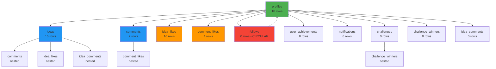

# Foreign Key Dependencies & Relationships Analysis
**Document:** 02 of 06  
**Generated:** November 5, 2025  
**Database:** NeuraCore (Supabase PostgreSQL)

---

## Table of Contents
1. [Dependency Overview](#1-dependency-overview)
2. [Dependency Graph](#2-dependency-graph)
3. [Foreign Key Constraints](#3-foreign-key-constraints)
4. [Cascade Behavior Analysis](#4-cascade-behavior-analysis)
5. [Circular Dependencies](#5-circular-dependencies)
6. [Orphan Risk Assessment](#6-orphan-risk-assessment)

---

## 1. Dependency Overview

### 1.1 Total Foreign Keys
```
Total FK Constraints: 30
├── Application Tables: 22
├── Storage Tables: 6
└── Legacy Tables: 2

Cascade Types:
├── NO ACTION (default): 30 (100%)
├── CASCADE: 0 (0%)
├── SET NULL: 0 (0%)
└── RESTRICT: 0 (0%)
```

### 1.2 Core Dependency Chain
```
auth.users (Supabase Auth)
    ↓
profiles (18 rows) ────────────────┐
    ├→ ideas (15 rows)             │
    │   ├→ comments (7 rows)       │
    │   │   └→ comment_likes (4)   │
    │   ├→ idea_likes (16 rows)    │
    │   └→ idea_comments (0)       │
    ├→ comments (7 rows) ──────────┤
    │   └→ comment_likes (4)       │
    ├→ idea_likes (16 rows)        │
    ├→ comment_likes (4 rows)      │
    ├→ follows (0 rows) ←──────────┘
    ├→ user_achievements (8)
    ├→ notifications (6 rows)
    ├→ challenges (0 rows)
    │   └→ challenge_winners (0)
    └→ idea_comments (0 rows)

achievements (5 rows)
    └→ user_achievements (8)

skills (0 rows)
    └→ user_skills (0)
```

---

## 2. Dependency Graph

### 2.1 Primary Entity: profiles
**Direct Dependents: 11 tables**



### 2.2 Secondary Entity: ideas
**Direct Dependents: 3 tables**

```sql
ideas (15 rows)
    ├→ comments (7 rows)
    │   └→ comment_likes (4 rows)
    ├→ idea_likes (16 rows)
    └→ idea_comments (0 rows)
```

### 2.3 Tertiary Entities

#### comments
```sql
comments (7 rows)
    └→ comment_likes (4 rows)
```

#### achievements
```sql
achievements (5 rows)
    └→ user_achievements (8 rows)
```

#### challenges
```sql
challenges (0 rows)
    └→ challenge_winners (0 rows)
```

#### skills
```sql
skills (0 rows)
    └→ user_skills (0 rows)
```

---

## 3. Foreign Key Constraints

### 3.1 Application Table Constraints

#### **ideas → profiles**
```sql
Foreign Key: ideas.author
References: profiles.id
Constraint: ideas_author_fkey
On Delete: NO ACTION
On Update: NO ACTION

Risk: Deleting a user leaves orphaned ideas
Impact: 15 ideas at risk
Recommendation: Change to CASCADE or implement soft deletes
```

#### **comments → ideas**
```sql
Foreign Key: comments.idea_id
References: ideas.id
Constraint: comments_idea_id_fkey
On Delete: NO ACTION
On Update: NO ACTION

Risk: Deleting an idea leaves orphaned comments
Impact: 7 comments at risk
Recommendation: Change to CASCADE
```

#### **comments → profiles**
```sql
Foreign Key: comments.author
References: profiles.id
Constraint: comments_author_fkey
On Delete: NO ACTION
On Update: NO ACTION

Risk: Deleting a user leaves orphaned comments
Impact: 7 comments at risk
Recommendation: Change to CASCADE or SET NULL
```

#### **idea_likes → ideas**
```sql
Foreign Key: idea_likes.idea_id
References: ideas.id
Constraint: idea_likes_idea_id_fkey
On Delete: NO ACTION
On Update: NO ACTION

Risk: Deleting an idea leaves orphaned likes
Impact: 16 likes at risk
Recommendation: Change to CASCADE
```

#### **idea_likes → profiles**
```sql
Foreign Key: idea_likes.user_id
References: profiles.id
Constraint: idea_likes_user_id_fkey
On Delete: NO ACTION
On Update: NO ACTION

Risk: Deleting a user leaves orphaned likes
Impact: 16 likes at risk
Recommendation: Change to CASCADE
```

#### **comment_likes → comments**
```sql
Foreign Key: comment_likes.comment_id
References: comments.id
Constraint: comment_likes_comment_id_fkey
On Delete: NO ACTION
On Update: NO ACTION

Risk: Deleting a comment leaves orphaned likes
Impact: 4 likes at risk
Recommendation: Change to CASCADE
```

#### **comment_likes → profiles**
```sql
Foreign Key: comment_likes.user_id
References: profiles.id
Constraint: comment_likes_user_id_fkey
On Delete: NO ACTION
On Update: NO ACTION

Risk: Deleting a user leaves orphaned likes
Impact: 4 likes at risk
Recommendation: Change to CASCADE
```

#### **follows → profiles (follower)**
```sql
Foreign Key: follows.follower_id
References: profiles.id
Constraint: follows_follower_id_fkey
On Delete: NO ACTION
On Update: NO ACTION

Risk: Deleting a user leaves orphaned follows
Impact: 0 follows currently (but future risk)
Recommendation: Change to CASCADE
```

#### **follows → profiles (following)**
```sql
Foreign Key: follows.following_id
References: profiles.id
Constraint: follows_following_id_fkey
On Delete: NO ACTION
On Update: NO ACTION

Risk: Deleting a user leaves orphaned follows
Impact: 0 follows currently (but future risk)
Recommendation: Change to CASCADE
```

#### **user_achievements → profiles**
```sql
Foreign Key: user_achievements.user_id
References: profiles.id
Constraint: user_achievements_user_id_fkey
On Delete: NO ACTION
On Update: NO ACTION

Risk: Deleting a user leaves orphaned achievements
Impact: 8 achievements at risk
Recommendation: Change to CASCADE
```

#### **user_achievements → achievements**
```sql
Foreign Key: user_achievements.achievement_id
References: achievements.id
Constraint: user_achievements_achievement_id_fkey
On Delete: NO ACTION
On Update: NO ACTION

Risk: Deleting an achievement leaves orphaned records
Impact: 8 unlocked achievements at risk
Recommendation: Change to CASCADE or RESTRICT
```

#### **notifications → profiles**
```sql
Foreign Key: notifications.user_id
References: profiles.id
Constraint: notifications_user_id_fkey
On Delete: NO ACTION
On Update: NO ACTION

Risk: Deleting a user leaves orphaned notifications
Impact: 6 notifications at risk
Recommendation: Change to CASCADE
```

#### **challenges → profiles**
```sql
Foreign Key: challenges.author
References: profiles.id
Constraint: challenges_author_fkey
On Delete: NO ACTION
On Update: NO ACTION

Risk: Deleting a user leaves orphaned challenges
Impact: 0 challenges currently (but future risk)
Recommendation: Change to SET NULL (preserve challenge)
```

#### **challenge_winners → challenges**
```sql
Foreign Key: challenge_winners.challenge_id
References: challenges.id
Constraint: challenge_winners_challenge_id_fkey
On Delete: NO ACTION
On Update: NO ACTION

Risk: Deleting a challenge leaves orphaned winners
Impact: 0 winners currently (but future risk)
Recommendation: Change to CASCADE
```

#### **challenge_winners → profiles**
```sql
Foreign Key: challenge_winners.user_id
References: profiles.id
Constraint: challenge_winners_user_id_fkey
On Delete: NO ACTION
On Update: NO ACTION

Risk: Deleting a user leaves orphaned winner records
Impact: 0 winners currently (but future risk)
Recommendation: Change to SET NULL (preserve history)
```

#### **idea_comments → ideas**
```sql
Foreign Key: idea_comments.idea_id
References: ideas.id
Constraint: idea_comments_idea_id_fkey
On Delete: NO ACTION
On Update: NO ACTION

Risk: Deleting an idea leaves orphaned comments
Impact: 0 comments currently (but future risk)
Recommendation: Change to CASCADE
```

#### **idea_comments → profiles**
```sql
Foreign Key: idea_comments.author
References: profiles.id
Constraint: idea_comments_author_fkey
On Delete: NO ACTION
On Update: NO ACTION

Risk: Deleting a user leaves orphaned comments
Impact: 0 comments currently (but future risk)
Recommendation: Change to CASCADE or SET NULL
```

### 3.2 Skills System Constraints

#### **user_skills → auth.users** ⚠️ BYPASS
```sql
Foreign Key: user_skills.user_id
References: auth.users.id (NOT profiles.id!)
Constraint: user_skills_user_id_fkey
On Delete: NO ACTION
On Update: NO ACTION

Critical Issue:
  - Bypasses profiles table
  - Direct reference to auth system
  - Inconsistent with other tables
  - May break if auth user deleted but profile exists
Recommendation: Change to reference profiles.id
```

#### **user_skills → skills**
```sql
Foreign Key: user_skills.skill_id
References: skills.id
Constraint: user_skills_skill_id_fkey
On Delete: NO ACTION
On Update: NO ACTION

Risk: Deleting a skill leaves orphaned user_skills
Impact: 0 user_skills currently (but future risk)
Recommendation: Change to CASCADE
```

### 3.3 Storage System Constraints

#### **objects → buckets**
```sql
Foreign Key: objects.bucket_id
References: buckets.id
Constraint: objects_bucket_id_fkey
On Delete: CASCADE
On Update: NO ACTION

✅ Correct: Objects deleted when bucket deleted
```

#### **prefixes → buckets**
```sql
Foreign Key: prefixes.bucket_id
References: buckets.id
Constraint: prefixes_bucket_id_fkey
On Delete: CASCADE
On Update: NO ACTION

✅ Correct: Prefixes deleted when bucket deleted
```

#### **s3_multipart_uploads → buckets**
```sql
Foreign Key: s3_multipart_uploads.bucket_id
References: buckets.id
Constraint: s3_multipart_uploads_bucket_id_fkey
On Delete: CASCADE
On Update: NO ACTION

✅ Correct: Uploads deleted when bucket deleted
```

#### **s3_multipart_uploads_parts → buckets**
```sql
Foreign Key: s3_multipart_uploads_parts.bucket_id
References: buckets.id
Constraint: s3_multipart_uploads_parts_bucket_id_fkey
On Delete: CASCADE
On Update: NO ACTION

✅ Correct: Upload parts deleted when bucket deleted
```

#### **s3_multipart_uploads_parts → uploads**
```sql
Foreign Key: s3_multipart_uploads_parts.upload_id
References: s3_multipart_uploads.id
Constraint: s3_multipart_uploads_parts_upload_id_fkey
On Delete: CASCADE
On Update: NO ACTION

✅ Correct: Parts deleted when upload deleted
```

### 3.4 Legacy System Constraints

#### **Account → posts** ⚠️ CIRCULAR
```sql
Foreign Key: Account.post_id
References: posts.acc_id
Constraint: Account_post_id_fkey
On Delete: NO ACTION
On Update: NO ACTION

Critical Issue:
  - Circular dependency with posts.acc_id
  - Invalid reference (post_id → acc_id mismatch)
  - Schema design flaw
Recommendation: Remove this constraint
```

#### **posts → Account** ⚠️ CIRCULAR
```sql
Foreign Key: posts.acc_id
References: Account.id
Constraint: posts_acc_id_fkey
On Delete: NO ACTION
On Update: NO ACTION

Critical Issue:
  - Circular dependency with Account.post_id
  - Prevents deletion of both tables
Recommendation: Keep this, remove Account.post_id FK
```

---

## 4. Cascade Behavior Analysis

### 4.1 Current Cascade Strategy
```
Cascade Type Distribution:
├── NO ACTION: 30 constraints (100%)
├── CASCADE: 0 constraints (0%)
├── SET NULL: 0 constraints (0%)
└── RESTRICT: 0 constraints (0%)

Impact:
  ❌ Deleting a user requires 11 manual cleanups
  ❌ Deleting an idea requires 3 manual cleanups
  ❌ Deleting a comment requires 1 manual cleanup
  ❌ High risk of orphaned data
```

### 4.2 Recommended Cascade Strategy

#### **User Deletion Cascade**
```sql
When deleting profiles.id:
  ├── CASCADE: ideas (preserve content? consider soft delete)
  ├── CASCADE: comments (or SET NULL with "Deleted User")
  ├── CASCADE: idea_likes (always cascade)
  ├── CASCADE: comment_likes (always cascade)
  ├── CASCADE: follows (both directions)
  ├── CASCADE: user_achievements (always cascade)
  ├── CASCADE: notifications (always cascade)
  ├── SET NULL: challenges.author (preserve challenge)
  ├── SET NULL: challenge_winners.user_id (preserve history)
  └── CASCADE: idea_comments (or SET NULL)

Recommendation: Implement soft deletes for profiles
  - Add: profiles.deleted_at timestamptz
  - Add: profiles.is_deleted boolean
  - Never physically delete profiles
  - CASCADE only engagement data (likes, follows)
```

#### **Content Deletion Cascade**
```sql
When deleting ideas.id:
  ├── CASCADE: comments
  │   └── CASCADE: comment_likes
  ├── CASCADE: idea_likes
  └── CASCADE: idea_comments

Recommendation: Allow full cascade
  - Deleting idea should remove all related data
  - Alternative: Soft delete with is_deleted flag
```

#### **Engagement Deletion Cascade**
```sql
When deleting comments.id:
  └── CASCADE: comment_likes

Recommendation: Allow full cascade
  - Deleting comment should remove its likes
```

### 4.3 Implementation SQL

#### **Fix User Deletion Cascade**
```sql
-- Drop existing constraints
ALTER TABLE ideas DROP CONSTRAINT ideas_author_fkey;
ALTER TABLE comments DROP CONSTRAINT comments_author_fkey;
ALTER TABLE idea_likes DROP CONSTRAINT idea_likes_user_id_fkey;
ALTER TABLE comment_likes DROP CONSTRAINT comment_likes_user_id_fkey;
ALTER TABLE follows DROP CONSTRAINT follows_follower_id_fkey;
ALTER TABLE follows DROP CONSTRAINT follows_following_id_fkey;
ALTER TABLE user_achievements DROP CONSTRAINT user_achievements_user_id_fkey;
ALTER TABLE notifications DROP CONSTRAINT notifications_user_id_fkey;

-- Add CASCADE constraints for engagement
ALTER TABLE idea_likes 
  ADD CONSTRAINT idea_likes_user_id_fkey 
  FOREIGN KEY (user_id) REFERENCES profiles(id) 
  ON DELETE CASCADE;

ALTER TABLE comment_likes 
  ADD CONSTRAINT comment_likes_user_id_fkey 
  FOREIGN KEY (user_id) REFERENCES profiles(id) 
  ON DELETE CASCADE;

ALTER TABLE follows 
  ADD CONSTRAINT follows_follower_id_fkey 
  FOREIGN KEY (follower_id) REFERENCES profiles(id) 
  ON DELETE CASCADE;

ALTER TABLE follows 
  ADD CONSTRAINT follows_following_id_fkey 
  FOREIGN KEY (following_id) REFERENCES profiles(id) 
  ON DELETE CASCADE;

ALTER TABLE user_achievements 
  ADD CONSTRAINT user_achievements_user_id_fkey 
  FOREIGN KEY (user_id) REFERENCES profiles(id) 
  ON DELETE CASCADE;

ALTER TABLE notifications 
  ADD CONSTRAINT notifications_user_id_fkey 
  FOREIGN KEY (user_id) REFERENCES profiles(id) 
  ON DELETE CASCADE;

-- Add SET NULL for content preservation
ALTER TABLE ideas 
  ADD CONSTRAINT ideas_author_fkey 
  FOREIGN KEY (author) REFERENCES profiles(id) 
  ON DELETE SET NULL;

ALTER TABLE comments 
  ADD CONSTRAINT comments_author_fkey 
  FOREIGN KEY (author) REFERENCES profiles(id) 
  ON DELETE SET NULL;

-- Add CASCADE for challenges system
ALTER TABLE challenges DROP CONSTRAINT challenges_author_fkey;
ALTER TABLE challenge_winners DROP CONSTRAINT challenge_winners_user_id_fkey;

ALTER TABLE challenges 
  ADD CONSTRAINT challenges_author_fkey 
  FOREIGN KEY (author) REFERENCES profiles(id) 
  ON DELETE SET NULL;

ALTER TABLE challenge_winners 
  ADD CONSTRAINT challenge_winners_user_id_fkey 
  FOREIGN KEY (user_id) REFERENCES profiles(id) 
  ON DELETE SET NULL;
```

#### **Fix Content Deletion Cascade**
```sql
-- Drop existing constraints
ALTER TABLE comments DROP CONSTRAINT comments_idea_id_fkey;
ALTER TABLE idea_likes DROP CONSTRAINT idea_likes_idea_id_fkey;
ALTER TABLE idea_comments DROP CONSTRAINT idea_comments_idea_id_fkey;
ALTER TABLE comment_likes DROP CONSTRAINT comment_likes_comment_id_fkey;

-- Add CASCADE constraints
ALTER TABLE comments 
  ADD CONSTRAINT comments_idea_id_fkey 
  FOREIGN KEY (idea_id) REFERENCES ideas(id) 
  ON DELETE CASCADE;

ALTER TABLE idea_likes 
  ADD CONSTRAINT idea_likes_idea_id_fkey 
  FOREIGN KEY (idea_id) REFERENCES ideas(id) 
  ON DELETE CASCADE;

ALTER TABLE idea_comments 
  ADD CONSTRAINT idea_comments_idea_id_fkey 
  FOREIGN KEY (idea_id) REFERENCES ideas(id) 
  ON DELETE CASCADE;

ALTER TABLE comment_likes 
  ADD CONSTRAINT comment_likes_comment_id_fkey 
  FOREIGN KEY (comment_id) REFERENCES comments(id) 
  ON DELETE CASCADE;
```

---

## 5. Circular Dependencies

### 5.1 Identified Circular References

#### **Account ↔ posts** ⚠️ CRITICAL
```
Account.post_id → posts.acc_id
posts.acc_id → Account.id

Issues:
  1. Cannot insert Account without existing posts
  2. Cannot insert posts without existing Account
  3. Cannot delete either table
  4. Schema design flaw

Resolution:
  - Remove Account.post_id foreign key
  - Keep posts.acc_id as one-way reference
  - Or deprecate both tables (they're empty)
```

#### **follows (self-referential)** ✅ VALID
```
follows.follower_id → profiles.id
follows.following_id → profiles.id

This is intentional:
  - Users follow users
  - Self-referential is expected
  - Not a circular dependency issue
```

### 5.2 Resolution SQL
```sql
-- Fix circular dependency in legacy tables
ALTER TABLE "Account" DROP CONSTRAINT IF EXISTS "Account_post_id_fkey";

-- Or deprecate entirely (recommended)
DROP TABLE IF EXISTS "Account" CASCADE;
DROP TABLE IF EXISTS "posts" CASCADE;
DROP TABLE IF EXISTS "Comments" CASCADE;
```

---

## 6. Orphan Risk Assessment

### 6.1 High Risk Orphans (Active Data)

#### **ideas without authors**
```
Current Risk: 15 ideas at risk
Trigger: User account deletion
Impact: Ideas appear authorless
Mitigation: 
  - Change FK to SET NULL
  - Display "[Deleted User]" for null authors
  - Or implement soft deletes
```

#### **comments without authors**
```
Current Risk: 7 comments at risk
Trigger: User account deletion
Impact: Comments appear anonymous
Mitigation:
  - Change FK to SET NULL
  - Display "[Deleted User]" for null authors
```

#### **likes without users**
```
Current Risk: 20 likes at risk (16 idea + 4 comment)
Trigger: User account deletion
Impact: Like counts incorrect
Mitigation:
  - Change FK to CASCADE
  - Decrement like counters automatically
```

#### **comments without ideas**
```
Current Risk: 7 comments at risk
Trigger: Idea deletion
Impact: Orphaned comments in database
Mitigation:
  - Change FK to CASCADE
  - Comments should die with idea
```

### 6.2 Medium Risk Orphans (No Current Data)

#### **follows without users**
```
Current Risk: None (0 follows)
Future Risk: High when feature launches
Mitigation: Change FK to CASCADE
```

#### **user_skills without users**
```
Current Risk: None (0 skills)
Future Risk: High when feature launches
Critical: Fix FK to reference profiles.id (not auth.users.id)
Mitigation: Change FK to CASCADE
```

#### **challenge data without users**
```
Current Risk: None (0 challenges)
Future Risk: Medium when feature launches
Mitigation: 
  - challenges.author → SET NULL (preserve challenge)
  - challenge_winners.user_id → SET NULL (preserve history)
```

### 6.3 Low Risk Orphans (Legacy Data)

#### **Legacy table orphans**
```
Current Risk: None (all tables empty)
Action: Delete legacy tables entirely
```

### 6.4 Orphan Detection Queries

#### **Find orphaned ideas**
```sql
SELECT i.id, i.title, i.author
FROM ideas i
LEFT JOIN profiles p ON i.author = p.id
WHERE p.id IS NULL;
```

#### **Find orphaned comments**
```sql
SELECT c.id, c.content, c.author, c.idea_id
FROM comments c
LEFT JOIN profiles p ON c.author = p.id
LEFT JOIN ideas i ON c.idea_id = i.id
WHERE p.id IS NULL OR i.id IS NULL;
```

#### **Find orphaned likes**
```sql
-- Idea likes
SELECT il.id, il.idea_id, il.user_id
FROM idea_likes il
LEFT JOIN ideas i ON il.idea_id = i.id
LEFT JOIN profiles p ON il.user_id = p.id
WHERE i.id IS NULL OR p.id IS NULL;

-- Comment likes
SELECT cl.id, cl.comment_id, cl.user_id
FROM comment_likes cl
LEFT JOIN comments c ON cl.comment_id = c.id
LEFT JOIN profiles p ON cl.user_id = p.id
WHERE c.id IS NULL OR p.id IS NULL;
```

#### **Find orphaned achievements**
```sql
SELECT ua.id, ua.user_id, ua.achievement_id
FROM user_achievements ua
LEFT JOIN profiles p ON ua.user_id = p.id
LEFT JOIN achievements a ON ua.achievement_id = a.id
WHERE p.id IS NULL OR a.id IS NULL;
```

---

## Summary & Recommendations

### Critical Actions Required
1. **Fix Cascade Behavior** (Priority: HIGH)
   - Add CASCADE to all engagement tables (likes, follows, notifications)
   - Add SET NULL to content tables (ideas, comments) with author fields
   - Test deletion scenarios before production

2. **Fix Circular Dependencies** (Priority: CRITICAL)
   - Remove Account.post_id foreign key
   - Or delete legacy tables entirely

3. **Fix user_skills Reference** (Priority: HIGH)
   - Change FK from auth.users.id to profiles.id
   - Maintain consistency across schema

4. **Implement Soft Deletes** (Priority: MEDIUM)
   - Add deleted_at to profiles
   - Never physically delete users
   - Preserve content with "[Deleted User]" display

### Validation Queries
```sql
-- Test cascade behavior after changes
BEGIN;
  DELETE FROM profiles WHERE id = 'test-user-uuid';
  -- Check if related data deleted/nulled correctly
ROLLBACK;
```

---

**Document Complete** | Next: [RLS Policies Analysis](./03_RLS_POLICIES_ANALYSIS.md)
