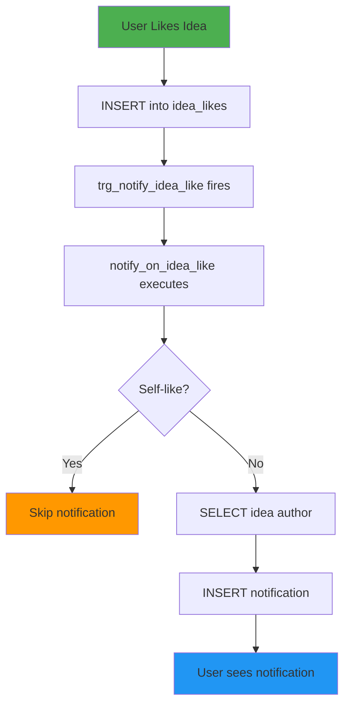

# Triggers & Automation Analysis
**Document:** 05 of 06  
**Generated:** November 5, 2025  
**Database:** NeuraCore (Supabase PostgreSQL)

---

## Table of Contents
1. [Trigger Overview](#1-trigger-overview)
2. [Application Triggers](#2-application-triggers)
3. [Storage System Triggers](#3-storage-system-triggers)
4. [Trigger Functions](#4-trigger-functions)
5. [Automation Workflows](#5-automation-workflows)
6. [Performance Considerations](#6-performance-considerations)
7. [Recommendations](#7-recommendations)

---

## 1. Trigger Overview

### 1.1 Trigger Distribution
```
Total Triggers: 13
├── Application Triggers: 6 (46%)
└── Storage System Triggers: 7 (54%)

By Purpose:
├── Notification Generation: 3 (23%)
├── Timestamp Management: 3 (23%)
├── Storage Hierarchy: 4 (31%)
├── Validation: 1 (8%)
└── Maintenance: 2 (15%)

By Timing:
├── BEFORE INSERT: 2
├── BEFORE UPDATE: 4
├── AFTER INSERT: 3
├── AFTER DELETE: 2
└── BEFORE INSERT OR UPDATE: 2
```

### 1.2 Trigger Execution Model
```
User Action → Database Event → Trigger Fires → Function Executes

Example Flow:
1. User likes an idea
2. INSERT into idea_likes
3. trg_notify_idea_like fires (AFTER INSERT)
4. notify_on_idea_like() executes
5. Notification created in notifications table
```

---

## 2. Application Triggers

### 2.1 Notification Triggers

#### **Trigger 1: trg_notify_idea_like**
```sql
Trigger: trg_notify_idea_like
Table: idea_likes
Timing: AFTER INSERT
Event: Each row
Function: notify_on_idea_like()

Purpose: Create notification when idea is liked
Execution Flow:
  1. User inserts into idea_likes
  2. Trigger fires after successful insert
  3. Function creates notification for idea author
  4. If author likes own idea → no notification

Function Definition:
CREATE OR REPLACE FUNCTION notify_on_idea_like()
RETURNS TRIGGER AS $$
DECLARE
  idea_author uuid;
BEGIN
  -- Get the idea author
  SELECT author INTO idea_author
  FROM ideas
  WHERE id = NEW.idea_id;
  
  -- Don't notify if user likes their own idea
  IF idea_author != NEW.user_id THEN
    INSERT INTO notifications (
      user_id,
      type,
      content,
      is_read
    ) VALUES (
      idea_author,
      'like',
      'Someone liked your idea',
      false
    );
  END IF;
  
  RETURN NEW;
END;
$$ LANGUAGE plpgsql SECURITY DEFINER;

Performance Impact: 🔶 Medium
  - 1 SELECT query (idea author lookup)
  - 1 INSERT query (notification creation)
  - Conditional logic (self-like check)

Data Volume: 16 idea_likes → 16 potential notifications

Optimization Opportunities:
  ⚠️ Could batch notifications
  ⚠️ Could use async queue
  ✅ Self-like check prevents spam
```

#### **Trigger 2: trg_notify_on_comment**
```sql
Trigger: trg_notify_on_comment
Table: comments
Timing: AFTER INSERT
Event: Each row
Function: notify_on_comment()

Purpose: Create notification when idea receives comment
Execution Flow:
  1. User inserts into comments
  2. Trigger fires after successful insert
  3. Function creates notification for idea author
  4. If author comments on own idea → no notification

Function Definition:
CREATE OR REPLACE FUNCTION notify_on_comment()
RETURNS TRIGGER AS $$
DECLARE
  idea_author uuid;
BEGIN
  -- Get the idea author
  SELECT author INTO idea_author
  FROM ideas
  WHERE id = NEW.idea_id;
  
  -- Don't notify if user comments on their own idea
  IF idea_author != NEW.author THEN
    INSERT INTO notifications (
      user_id,
      type,
      content,
      is_read
    ) VALUES (
      idea_author,
      'comment',
      'Someone commented on your idea',
      false
    );
  END IF;
  
  RETURN NEW;
END;
$$ LANGUAGE plpgsql SECURITY DEFINER;

Performance Impact: 🔶 Medium
  - 1 SELECT query (idea author lookup)
  - 1 INSERT query (notification creation)
  - Conditional logic (self-comment check)

Data Volume: 7 comments → 7 potential notifications

Enhancements Needed:
  ⚠️ No notification content details (which idea?)
  ⚠️ No reference to source comment (can't link back)
  ✅ Self-comment check prevents spam
```

#### **Trigger 3: trg_notify_comment_like**
```sql
Trigger: trg_notify_comment_like
Table: comment_likes
Timing: AFTER INSERT
Event: Each row
Function: notify_on_comment_like()

Purpose: Create notification when comment is liked
Execution Flow:
  1. User inserts into comment_likes
  2. Trigger fires after successful insert
  3. Function creates notification for comment author
  4. If author likes own comment → no notification

Function Definition:
CREATE OR REPLACE FUNCTION notify_on_comment_like()
RETURNS TRIGGER AS $$
DECLARE
  comment_author uuid;
BEGIN
  -- Get the comment author
  SELECT author INTO comment_author
  FROM comments
  WHERE id = NEW.comment_id;
  
  -- Don't notify if user likes their own comment
  IF comment_author != NEW.user_id THEN
    INSERT INTO notifications (
      user_id,
      type,
      content,
      is_read
    ) VALUES (
      comment_author,
      'like',
      'Someone liked your comment',
      false
    );
  END IF;
  
  RETURN NEW;
END;
$$ LANGUAGE plpgsql SECURITY DEFINER;

Performance Impact: 🔶 Medium
  - 1 SELECT query (comment author lookup)
  - 1 INSERT query (notification creation)
  - Conditional logic (self-like check)

Data Volume: 4 comment_likes → 4 potential notifications

Similar Issues:
  ⚠️ No notification content details
  ⚠️ No reference to source comment
  ✅ Self-like check prevents spam
```

**Notification Triggers Summary:**
```
Common Pattern:
  1. Get content author
  2. Check if action is self-performed
  3. Create notification if not self

Performance Concerns:
  - 3 triggers × average 2 queries each = 6 extra queries per engagement
  - No batching (each like = separate notification)
  - No rate limiting (spam potential)
  - No notification consolidation ("3 people liked your idea")

Improvements Needed:
  - Add metadata to notifications (source_id, source_type)
  - Implement notification batching
  - Add rate limiting
  - Consider async processing
```

### 2.2 Timestamp Management Triggers

#### **Trigger 4: update_profiles_updated_at**
```sql
Trigger: update_profiles_updated_at
Table: profiles
Timing: BEFORE UPDATE
Event: Each row
Function: update_updated_at_column()

Purpose: Auto-update updated_at timestamp on row modification
Execution Flow:
  1. User updates profile
  2. Trigger fires before update
  3. Function sets updated_at = now()
  4. Update proceeds with new timestamp

Function Definition:
CREATE OR REPLACE FUNCTION update_updated_at_column()
RETURNS TRIGGER AS $$
BEGIN
  NEW.updated_at = now();
  RETURN NEW;
END;
$$ LANGUAGE plpgsql;

Performance Impact: ⚡ Minimal
  - Simple assignment
  - No queries
  - No conditional logic

Data Volume: 18 profiles (low update frequency)

Status: ✅ Standard pattern, efficient
```

#### **Trigger 5: update_ideas_updated_at**
```sql
Trigger: update_ideas_updated_at
Table: ideas
Timing: BEFORE UPDATE
Event: Each row
Function: update_updated_at_column()

Purpose: Auto-update updated_at timestamp on idea modification
Execution Flow:
  1. User edits idea
  2. Trigger fires before update
  3. Function sets updated_at = now()
  4. Update proceeds with new timestamp

Performance Impact: ⚡ Minimal
Data Volume: 15 ideas (medium update frequency)

Status: ✅ Standard pattern, efficient

Use Cases:
  - Track when idea last edited
  - Sort by recently updated
  - Audit trail
```

#### **Trigger 6: update_comments_updated_at**
```sql
Trigger: update_comments_updated_at
Table: comments
Timing: BEFORE UPDATE
Event: Each row
Function: update_updated_at_column()

Purpose: Auto-update updated_at timestamp on comment modification
Execution Flow:
  1. User edits comment
  2. Trigger fires before update
  3. Function sets updated_at = now()
  4. Update proceeds with new timestamp

Performance Impact: ⚡ Minimal
Data Volume: 7 comments (low-medium update frequency)

Status: ✅ Standard pattern, efficient

Use Cases:
  - Show "edited" badge on comments
  - Track comment history
  - Audit trail
```

**Timestamp Triggers Summary:**
```
Shared Function: update_updated_at_column()
  - Reusable across all tables
  - Simple and efficient
  - BEFORE UPDATE prevents recursion

Benefits:
  ✅ Automatic timestamp management
  ✅ Prevents manual errors
  ✅ Consistent across all tables
  ✅ No performance overhead

Missing Triggers:
  ⚠️ notifications doesn't have updated_at trigger
  ⚠️ user_achievements doesn't have updated_at trigger
  ⚠️ challenges/challenge_winners don't have triggers
```

---

## 3. Storage System Triggers

### 3.1 Hierarchy Management Triggers

#### **Trigger 7: objects_insert_create_prefix**
```sql
Trigger: objects_insert_create_prefix
Table: storage.objects
Timing: BEFORE INSERT
Event: Each row
Function: create_prefix_for_object()

Purpose: Create folder hierarchy when object is inserted
Execution Flow:
  1. User uploads file to storage
  2. INSERT into storage.objects
  3. Trigger fires before insert
  4. Function creates/updates prefix hierarchy
  5. Insert proceeds

Example:
  File path: "users/avatars/profile.jpg"
  Prefixes created:
    - users/ (level 1)
    - users/avatars/ (level 2)

Function Logic:
  - Parse object name for folder structure
  - Create entries in storage.prefixes
  - Maintain level hierarchy

Performance Impact: 🔶 Medium
  - Multiple INSERT operations for nested paths
  - String parsing overhead

Data Volume: 0 objects currently (future impact)

Status: ✅ System-managed (Supabase)
```

#### **Trigger 8: objects_update_create_prefix**
```sql
Trigger: objects_update_create_prefix
Table: storage.objects
Timing: BEFORE UPDATE
Event: Each row
Function: create_prefix_for_object()

Purpose: Update folder hierarchy when object is moved/renamed
Execution Flow:
  1. Object name/path changed
  2. UPDATE on storage.objects
  3. Trigger fires before update
  4. Function updates prefix hierarchy
  5. Update proceeds

Performance Impact: 🔶 Medium
Data Volume: 0 objects currently

Status: ✅ System-managed (Supabase)
```

#### **Trigger 9: objects_delete_delete_prefix**
```sql
Trigger: objects_delete_delete_prefix
Table: storage.objects
Timing: AFTER DELETE
Event: Each row
Function: delete_prefix_for_object()

Purpose: Clean up empty folders when object is deleted
Execution Flow:
  1. Object deleted from storage
  2. DELETE from storage.objects
  3. Trigger fires after delete
  4. Function checks if folder is now empty
  5. Delete empty prefixes

Function Logic:
  - Count remaining objects in folder
  - If count = 0, delete prefix
  - Recursively check parent folders

Performance Impact: 🔶 Medium
  - Multiple COUNT queries
  - Potential recursive deletions

Data Volume: 0 objects currently

Status: ✅ System-managed (Supabase)
```

#### **Trigger 10: prefixes_create_hierarchy**
```sql
Trigger: prefixes_create_hierarchy
Table: storage.prefixes
Timing: BEFORE INSERT
Event: Each row
Function: create_parent_prefixes()

Purpose: Ensure all parent folders exist when creating prefix
Execution Flow:
  1. Prefix created (e.g., "users/avatars/")
  2. Trigger fires before insert
  3. Function creates parent prefixes if missing
     - "users/"
  4. Insert proceeds

Performance Impact: 🔶 Medium
  - Recursive parent creation
  - String parsing

Status: ✅ System-managed (Supabase)
```

#### **Trigger 11: prefixes_delete_hierarchy**
```sql
Trigger: prefixes_delete_hierarchy
Table: storage.prefixes
Timing: AFTER DELETE
Event: Each row
Function: delete_child_prefixes()

Purpose: Clean up child folders when parent is deleted
Execution Flow:
  1. Parent folder deleted (e.g., "users/")
  2. Trigger fires after delete
  3. Function deletes all child prefixes
     - "users/avatars/"
     - "users/documents/"
  4. Cascading cleanup

Performance Impact: 🔴 High (if many children)
  - Recursive deletions
  - Multiple queries

Status: ✅ System-managed (Supabase)
```

### 3.2 Validation & Maintenance Triggers

#### **Trigger 12: enforce_bucket_name_length_trigger**
```sql
Trigger: enforce_bucket_name_length_trigger
Table: storage.buckets
Timing: BEFORE INSERT OR UPDATE
Event: Each row
Function: enforce_bucket_name_length()

Purpose: Validate bucket name length constraints
Execution Flow:
  1. Bucket created/updated
  2. Trigger fires before operation
  3. Function validates name length
  4. Raise exception if invalid
  5. Operation proceeds if valid

Validation Rules:
  - Minimum length: 3 characters
  - Maximum length: 63 characters
  - Character restrictions: [a-z0-9-]

Performance Impact: ⚡ Minimal
  - Simple string length check

Status: ✅ System-managed (Supabase)
```

#### **Trigger 13: update_objects_updated_at**
```sql
Trigger: update_objects_updated_at
Table: storage.objects
Timing: BEFORE UPDATE
Event: Each row
Function: update_updated_at_column()

Purpose: Auto-update timestamp on object modification
Execution Flow:
  Same as application timestamp triggers

Performance Impact: ⚡ Minimal

Status: ✅ System-managed (Supabase)
```

**Storage Triggers Summary:**
```
Purpose: Maintain storage hierarchy integrity
Complexity: High (recursive operations)
Performance: Medium to High overhead
Management: System-managed (don't modify)

Critical for:
  ✅ Folder structure navigation
  ✅ Orphan prevention
  ✅ Storage consistency
  ✅ Validation
```

---

## 4. Trigger Functions

### 4.1 Function Inventory

#### **notify_on_idea_like()**
```sql
Type: Notification generator
Security: SECURITY DEFINER
Language: plpgsql
Returns: TRIGGER

Dependencies:
  - ideas.author (SELECT)
  - notifications (INSERT)

Error Handling: ❌ None
  - No TRY/CATCH
  - No NULL checks
  - Assumes idea exists

Improvements:
  1. Add error handling
  2. Add idea existence check
  3. Include idea title in notification
  4. Add reference fields (source_id, source_type)
```

#### **notify_on_comment()**
```sql
Type: Notification generator
Security: SECURITY DEFINER
Language: plpgsql
Returns: TRIGGER

Dependencies:
  - ideas.author (SELECT)
  - notifications (INSERT)

Error Handling: ❌ None

Improvements:
  1. Add error handling
  2. Include commenter name
  3. Include idea title
  4. Add reference fields
```

#### **notify_on_comment_like()**
```sql
Type: Notification generator
Security: SECURITY DEFINER
Language: plpgsql
Returns: TRIGGER

Dependencies:
  - comments.author (SELECT)
  - notifications (INSERT)

Error Handling: ❌ None

Improvements:
  1. Add error handling
  2. Include comment preview
  3. Include liker name
  4. Add reference fields
```

#### **update_updated_at_column()**
```sql
Type: Timestamp updater
Security: Default (invoker)
Language: plpgsql
Returns: TRIGGER

Dependencies: None (uses now())

Error Handling: ✅ Not needed (simple assignment)

Status: ✅ Perfect as-is

Reusability: ✅ Used by multiple tables
  - profiles
  - ideas
  - comments
  - storage.objects
```

#### **Storage System Functions** (5 functions)
```sql
Functions:
  1. create_prefix_for_object()
  2. delete_prefix_for_object()
  3. create_parent_prefixes()
  4. delete_child_prefixes()
  5. enforce_bucket_name_length()

Type: System maintenance
Security: SECURITY DEFINER
Language: plpgsql
Management: Supabase-managed

Status: 🔒 Do not modify
```

### 4.2 Function Security Analysis

#### **SECURITY DEFINER Risk**
```sql
Functions with SECURITY DEFINER:
  - notify_on_idea_like()
  - notify_on_comment()
  - notify_on_comment_like()
  - Storage system functions (5)

Risk Level: 🔶 Medium

Security Implications:
  ✅ Allows notifications to be created regardless of RLS
  ⚠️ Runs with elevated privileges
  ⚠️ Could be exploited if function has bugs
  ⚠️ No rate limiting

Mitigations:
  1. Add input validation
  2. Add rate limiting
  3. Add error handling
  4. Audit function code regularly
```

#### **Missing Security Checks**
```sql
No validation for:
  ❌ Maximum notifications per user per day
  ❌ Spam prevention
  ❌ Duplicate notification prevention
  ❌ Invalid reference handling

Recommendations:
  1. Add rate limiting
  2. Add duplicate checks
  3. Add existence validation
  4. Implement notification batching
```

---

## 5. Automation Workflows

### 5.1 Engagement Notification Workflow



### 5.2 Complete User Action Flows

#### **Flow 1: Like an Idea**
```
1. User Action: Click "Like" button
2. Application: POST /api/ideas/like
3. Database: INSERT into idea_likes (idea_id, user_id)
4. Trigger: trg_notify_idea_like fires
5. Function: notify_on_idea_like() executes
   a. SELECT author from ideas
   b. IF author != current_user
   c. INSERT into notifications
6. Result: 
   - Like recorded
   - Notification created (if not self-like)
   - Notification appears in author's feed

Total Operations: 1 INSERT + 1 SELECT + 1 INSERT = 3 queries
Latency: ~10-20ms
```

#### **Flow 2: Comment on Idea**
```
1. User Action: Submit comment
2. Application: POST /api/comments/create
3. Database: INSERT into comments (idea_id, author, content)
4. Trigger: trg_notify_on_comment fires
5. Function: notify_on_comment() executes
   a. SELECT author from ideas
   b. IF author != current_user
   c. INSERT into notifications
6. Result:
   - Comment created
   - Notification created (if not self-comment)
   - Idea author notified

Total Operations: 1 INSERT + 1 SELECT + 1 INSERT = 3 queries
Latency: ~10-20ms
```

#### **Flow 3: Edit Profile**
```
1. User Action: Update profile
2. Application: PATCH /api/profile
3. Database: UPDATE profiles SET ... WHERE id = user_id
4. Trigger: update_profiles_updated_at fires
5. Function: update_updated_at_column() executes
   a. SET NEW.updated_at = now()
6. Result:
   - Profile updated
   - Timestamp automatically updated
   - No additional queries

Total Operations: 1 UPDATE (modified in-place)
Latency: ~5ms
```

#### **Flow 4: Upload File (Future)**
```
1. User Action: Upload avatar
2. Application: POST /api/storage/upload
3. Storage: Create object in bucket
4. Database: INSERT into storage.objects (bucket_id, name, ...)
5. Trigger: objects_insert_create_prefix fires
6. Function: create_prefix_for_object() executes
   a. Parse file path
   b. INSERT into storage.prefixes (if not exists)
   c. Recursive parent creation
7. Result:
   - File stored
   - Folder hierarchy created
   - Prefix entries for navigation

Total Operations: 1 INSERT + N prefix operations
Latency: ~20-50ms (depends on folder depth)
```

### 5.3 Missing Automation Opportunities

#### **1. Auto-increment Counters**
```sql
-- Current: Denormalized counters in ideas table
-- Problem: No triggers to update them

-- Missing Trigger: Update ideas.likes on like
CREATE OR REPLACE FUNCTION update_idea_like_count()
RETURNS TRIGGER AS $$
BEGIN
  IF TG_OP = 'INSERT' THEN
    UPDATE ideas 
    SET likes = likes + 1 
    WHERE id = NEW.idea_id;
  ELSIF TG_OP = 'DELETE' THEN
    UPDATE ideas 
    SET likes = likes - 1 
    WHERE id = OLD.idea_id;
  END IF;
  RETURN NULL;
END;
$$ LANGUAGE plpgsql;

CREATE TRIGGER trg_update_idea_likes
  AFTER INSERT OR DELETE ON idea_likes
  FOR EACH ROW
  EXECUTE FUNCTION update_idea_like_count();

-- Similar for comments_count, etc.
```

#### **2. Achievement Auto-Award**
```sql
-- Current: No automatic achievement unlocking
-- Opportunity: Award achievements via triggers

-- Example: "First Idea" achievement
CREATE OR REPLACE FUNCTION award_first_idea()
RETURNS TRIGGER AS $$
DECLARE
  user_idea_count int;
  first_idea_achievement uuid;
BEGIN
  -- Count user's ideas
  SELECT COUNT(*) INTO user_idea_count
  FROM ideas
  WHERE author = NEW.author;
  
  -- If this is their first idea
  IF user_idea_count = 1 THEN
    -- Get "First Idea" achievement ID
    SELECT id INTO first_idea_achievement
    FROM achievements
    WHERE name = 'first_idea';
    
    -- Award achievement
    INSERT INTO user_achievements (user_id, achievement_id)
    VALUES (NEW.author, first_idea_achievement)
    ON CONFLICT DO NOTHING;
  END IF;
  
  RETURN NEW;
END;
$$ LANGUAGE plpgsql;

CREATE TRIGGER trg_award_first_idea
  AFTER INSERT ON ideas
  FOR EACH ROW
  EXECUTE FUNCTION award_first_idea();
```

#### **3. Soft Delete Triggers**
```sql
-- If implementing soft deletes
-- Auto-set deleted_at instead of DELETE

-- Prevent hard deletes
CREATE OR REPLACE FUNCTION prevent_hard_delete()
RETURNS TRIGGER AS $$
BEGIN
  RAISE EXCEPTION 'Direct deletion not allowed. Use soft delete.';
END;
$$ LANGUAGE plpgsql;

CREATE TRIGGER prevent_profile_delete
  BEFORE DELETE ON profiles
  FOR EACH ROW
  EXECUTE FUNCTION prevent_hard_delete();

-- Soft delete function
CREATE OR REPLACE FUNCTION soft_delete_profile()
RETURNS void AS $$
BEGIN
  UPDATE profiles
  SET deleted_at = now(),
      is_deleted = true
  WHERE id = auth.uid();
END;
$$ LANGUAGE plpgsql SECURITY DEFINER;
```

#### **4. Cascade Counter Updates**
```sql
-- Update parent counters when child created/deleted

-- Example: Update ideas.comments_count
CREATE OR REPLACE FUNCTION update_idea_comment_count()
RETURNS TRIGGER AS $$
BEGIN
  IF TG_OP = 'INSERT' THEN
    UPDATE ideas 
    SET comments_count = comments_count + 1 
    WHERE id = NEW.idea_id;
  ELSIF TG_OP = 'DELETE' THEN
    UPDATE ideas 
    SET comments_count = comments_count - 1 
    WHERE id = OLD.idea_id;
  END IF;
  RETURN NULL;
END;
$$ LANGUAGE plpgsql;

CREATE TRIGGER trg_update_comment_count
  AFTER INSERT OR DELETE ON comments
  FOR EACH ROW
  EXECUTE FUNCTION update_idea_comment_count();
```

---

## 6. Performance Considerations

### 6.1 Current Performance Impact

#### **Per-Engagement Overhead**
```
Like an Idea:
  Base operation: 1 INSERT (idea_likes)
  Trigger overhead: +2 queries (SELECT + INSERT notification)
  Total: 3 queries
  Overhead: +200%

Comment on Idea:
  Base operation: 1 INSERT (comments)
  Trigger overhead: +2 queries (SELECT + INSERT notification)
  Total: 3 queries
  Overhead: +200%

Like a Comment:
  Base operation: 1 INSERT (comment_likes)
  Trigger overhead: +2 queries (SELECT + INSERT notification)
  Total: 3 queries
  Overhead: +200%

Edit Profile:
  Base operation: 1 UPDATE (profiles)
  Trigger overhead: 0 queries (in-place timestamp update)
  Total: 1 query
  Overhead: 0%
```

#### **Cumulative Impact**
```
Current Data:
  - 16 idea_likes → 16 trigger executions → 32 extra queries
  - 7 comments → 7 trigger executions → 14 extra queries
  - 4 comment_likes → 4 trigger executions → 8 extra queries
  Total: 27 trigger executions → 54 extra queries

At Scale (10,000 users):
  - 50,000 likes/day → 100,000 extra queries/day
  - 10,000 comments/day → 20,000 extra queries/day
  Total: ~120,000 extra queries/day from triggers

Impact: 🔶 Medium (manageable but should optimize)
```

### 6.2 Optimization Strategies

#### **1. Notification Batching**
```sql
-- Instead of immediate notifications, batch them
-- Create notification_queue table

CREATE TABLE notification_queue (
  id uuid PRIMARY KEY DEFAULT uuid_generate_v4(),
  user_id uuid REFERENCES profiles(id),
  type varchar NOT NULL,
  source_type varchar NOT NULL,
  source_id uuid NOT NULL,
  created_at timestamptz DEFAULT now()
);

-- Modified trigger function
CREATE OR REPLACE FUNCTION queue_notification()
RETURNS TRIGGER AS $$
BEGIN
  INSERT INTO notification_queue (
    user_id, type, source_type, source_id
  ) VALUES (
    [target_user], 
    TG_ARGV[0], 
    TG_ARGV[1], 
    NEW.id
  );
  RETURN NEW;
END;
$$ LANGUAGE plpgsql;

-- Process queue every 1 minute (background job)
-- Consolidate: "3 people liked your idea" instead of 3 separate
```

#### **2. Async Processing**
```sql
-- Use pg_notify for async notification creation
-- Triggers send event, background worker processes

CREATE OR REPLACE FUNCTION notify_async()
RETURNS TRIGGER AS $$
BEGIN
  PERFORM pg_notify(
    'notification_channel',
    json_build_object(
      'type', TG_ARGV[0],
      'user_id', [target_user],
      'source_id', NEW.id
    )::text
  );
  RETURN NEW;
END;
$$ LANGUAGE plpgsql;

-- Application listens and processes asynchronously
```

#### **3. Conditional Triggers**
```sql
-- Only fire triggers during business hours
-- Or implement rate limiting

CREATE OR REPLACE FUNCTION notify_with_rate_limit()
RETURNS TRIGGER AS $$
DECLARE
  recent_notifications int;
BEGIN
  -- Check recent notification count
  SELECT COUNT(*) INTO recent_notifications
  FROM notifications
  WHERE user_id = [target_user]
    AND created_at > now() - interval '1 hour';
  
  -- Only create if under limit
  IF recent_notifications < 50 THEN
    INSERT INTO notifications (...) VALUES (...);
  END IF;
  
  RETURN NEW;
END;
$$ LANGUAGE plpgsql;
```

#### **4. Index Optimization**
```sql
-- Ensure trigger functions use indexes

-- Bad: SELECT author FROM ideas WHERE id = NEW.idea_id
-- If no index on ideas.id → full table scan

-- Good: CREATE INDEX idx_ideas_id ON ideas(id);
-- (Already exists as PRIMARY KEY)

-- Verify with EXPLAIN ANALYZE
EXPLAIN ANALYZE
SELECT author FROM ideas WHERE id = 'some-uuid';
```

### 6.3 Monitoring & Debugging

#### **Trigger Execution Tracking**
```sql
-- Create trigger log table
CREATE TABLE trigger_execution_log (
  id uuid PRIMARY KEY DEFAULT uuid_generate_v4(),
  trigger_name text,
  table_name text,
  execution_time interval,
  executed_at timestamptz DEFAULT now()
);

-- Instrument functions
CREATE OR REPLACE FUNCTION notify_on_idea_like_instrumented()
RETURNS TRIGGER AS $$
DECLARE
  start_time timestamptz;
  end_time timestamptz;
BEGIN
  start_time := clock_timestamp();
  
  -- Original function logic
  [...]
  
  end_time := clock_timestamp();
  
  INSERT INTO trigger_execution_log (
    trigger_name, table_name, execution_time
  ) VALUES (
    'notify_on_idea_like', 'idea_likes', end_time - start_time
  );
  
  RETURN NEW;
END;
$$ LANGUAGE plpgsql;
```

#### **Error Logging**
```sql
-- Add error handling to notification functions
CREATE OR REPLACE FUNCTION notify_on_idea_like_safe()
RETURNS TRIGGER AS $$
DECLARE
  idea_author uuid;
BEGIN
  BEGIN
    SELECT author INTO STRICT idea_author
    FROM ideas
    WHERE id = NEW.idea_id;
    
    IF idea_author != NEW.user_id THEN
      INSERT INTO notifications (...) VALUES (...);
    END IF;
    
  EXCEPTION
    WHEN NO_DATA_FOUND THEN
      -- Log error: idea not found
      INSERT INTO trigger_errors (
        trigger_name, error_message, context
      ) VALUES (
        'notify_on_idea_like',
        'Idea not found',
        json_build_object('idea_id', NEW.idea_id)
      );
    WHEN OTHERS THEN
      -- Log unexpected error
      INSERT INTO trigger_errors (
        trigger_name, error_message, context
      ) VALUES (
        'notify_on_idea_like',
        SQLERRM,
        json_build_object('idea_id', NEW.idea_id)
      );
  END;
  
  RETURN NEW;
END;
$$ LANGUAGE plpgsql SECURITY DEFINER;
```

---

## 7. Recommendations

### 7.1 Immediate Actions (High Priority)

#### **1. Add Error Handling to Notification Functions**
```sql
-- Wrap all notification functions in TRY/CATCH
-- Log errors instead of failing
-- Prevent trigger failures from blocking user actions

Priority: 🔴 Critical
Impact: Prevents data loss from trigger errors
Effort: Low (2 hours)
```

#### **2. Add Metadata to Notifications**
```sql
-- Add columns to notifications table
ALTER TABLE notifications ADD COLUMN source_type varchar;
ALTER TABLE notifications ADD COLUMN source_id uuid;
ALTER TABLE notifications ADD COLUMN metadata jsonb;

-- Update trigger functions to include metadata
-- Enables: Click notification → go to source

Priority: 🔴 High
Impact: Better user experience
Effort: Medium (4 hours)
```

#### **3. Implement Counter Update Triggers**
```sql
-- Auto-update denormalized counters
-- ideas.likes, ideas.comments_count, comments.likes

-- Ensures consistency
-- Removes need for manual counter management

Priority: 🔴 High
Impact: Data consistency
Effort: Medium (4 hours)
```

### 7.2 Short-term Improvements

#### **4. Add Achievement Auto-Award Triggers**
```sql
-- Automatically unlock achievements
-- "First Idea", "10 Likes", "Active Commenter"

Priority: 🟡 Medium
Impact: Gamification automation
Effort: High (8 hours)
```

#### **5. Implement Notification Batching**
```sql
-- Queue notifications instead of immediate creation
-- Background job consolidates
-- "3 people liked your idea" instead of 3 notifications

Priority: 🟡 Medium
Impact: Reduced notification spam
Effort: High (8 hours)
```

#### **6. Add Trigger Performance Monitoring**
```sql
-- Track trigger execution times
-- Identify slow triggers
-- Optimize problematic functions

Priority: 🟡 Medium
Impact: Performance insights
Effort: Medium (4 hours)
```

### 7.3 Long-term Enhancements

#### **7. Migrate to Edge Functions for Complex Logic**
```sql
-- Move notification creation to Edge Functions
-- Triggers only queue events
-- Edge Functions handle:
  - Consolidation
  - Rate limiting
  - Rich notifications
  - Push notifications

Priority: 🟢 Low
Impact: Scalability
Effort: Very High (40 hours)
```

#### **8. Implement Audit Trail Triggers**
```sql
-- Track all changes to critical tables
-- Create audit_log table
-- Triggers record before/after values

Priority: 🟢 Low
Impact: Compliance, debugging
Effort: High (16 hours)
```

#### **9. Add Soft Delete Triggers**
```sql
-- Prevent hard deletes
-- Auto-set deleted_at
-- Maintain referential integrity

Priority: 🟢 Low
Impact: Data recovery
Effort: Medium (8 hours)
```

---

## Summary

### Current State
```
Total Triggers: 13
├── Working Well: 3 timestamp triggers
├── Need Improvement: 3 notification triggers
└── System-Managed: 7 storage triggers

Performance Impact:
├── Timestamp: Negligible
├── Notifications: +200% query overhead per engagement
└── Storage: Medium (when in use)

Missing Automation:
├── Counter updates (critical)
├── Achievement awards (medium)
├── Error handling (critical)
└── Notification metadata (high)
```

### Priority Actions
```
Critical (Do Immediately):
  1. Add error handling to notification functions
  2. Add metadata to notifications
  3. Implement counter update triggers

Important (This Sprint):
  4. Add achievement auto-award
  5. Add trigger monitoring
  6. Implement notification batching

Nice to Have (Future):
  7. Edge Functions migration
  8. Audit trail triggers
  9. Soft delete triggers
```

### Expected Outcomes
```
After Improvements:
  ✅ Consistent counter values
  ✅ Resilient to errors
  ✅ Rich notifications with context
  ✅ Automated gamification
  ✅ Better performance monitoring
  ✅ Reduced notification spam
```

---

**Document Complete** | Next: [Data Integrity Analysis](./06_DATA_INTEGRITY_ANALYSIS.md)
